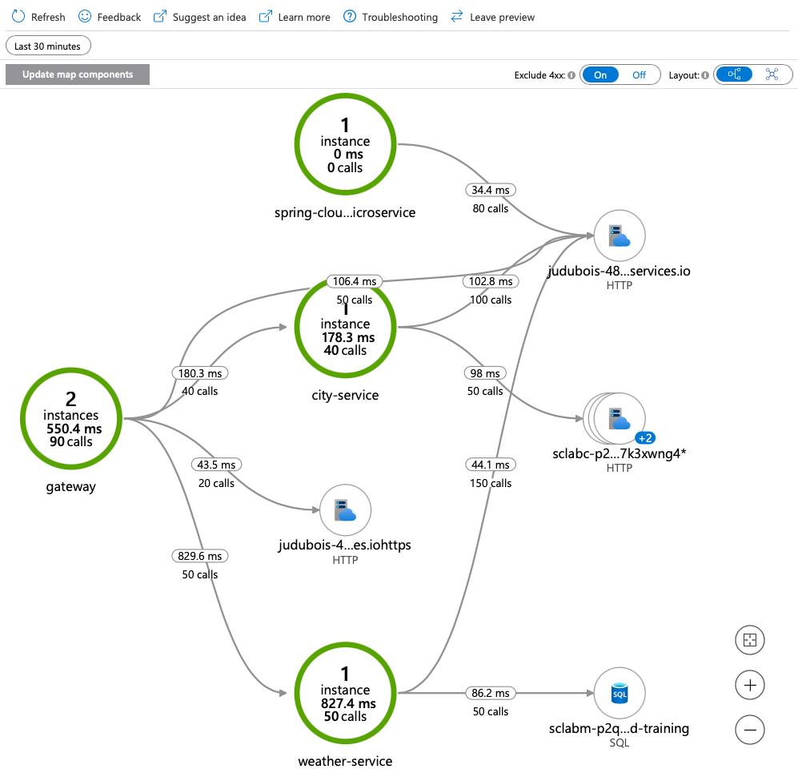

# 09 - Putting it all together, a complete microservice stack

__This guide is part of the [Azure Spring Cloud training](../README.md)__

Use a front-end to access graphically our complete microservice stack. Monitor our services with Azure Spring Cloud's distributed tracing mechanism, and scale our services depending on our needs.

---

## Add a front-end to the microservices stack

We now have a complete microservices stack:

- A gateway based on Spring Cloud Gateway.
- A reactive `city-service` microservice, that stores its data on Cosmos DB.
- A `weather-service` microservice, that stores its data on MySQL

In order to finish this architecture, we need to add a front-end to it:

- We've already built a VueJS application, that is available in the ["weather-app" folder](weather-app/).
- This front-end could be hosted in Azure Spring Cloud, using the same domain name (this won't be the case in this guide, and that's why we enabled CORS in our gateway earlier).
- If you are familiar with NodeJS and Vue CLI, you can run this application locally by typing `npm install && vue ui`.

In order to simplify this part, which is not relevant to understanding Spring Cloud, we have already built a running front-end:

__[https://spring-training.azureedge.net/](https://spring-training.azureedge.net/)__

For your information, this website is hosted on Azure Storage and served through Azure CDN for optimum performance.

Go to [https://spring-training.azureedge.net/](https://spring-training.azureedge.net/), input your Spring Cloud Gateway's public URL in the text field and click on "Go". You should see the following screen:

## Review the distributed tracing to better understand the architecture

We have already enabled distributed tracing on our Azure Spring Cloud instance in Section 1 by adding the `--enable-java-agent` flag to the create command.

Now, you can use the VueJS application on [https://spring-training.azureedge.net/](https://spring-training.azureedge.net/) to generate some traffic on the microservices stack.

>💡 Tracing data can take a couple of minutes to be ingested by the system, so use this time to generate some load.

In the "Application Insights" menu in Azure Portal, you should now have access to a full application map, as well as a search engine that allows you to find performance bottlenecks.

> 💡 If your application map looks different from the one above, select the hierarchical view from the layout switch in the top-right corner:
>
> 

## Review the performance metrics

Open a more holistic view at the `Performance` blade where you can see response times and request counts for operations exposed by your applications.

For even more detailed data, navigate to the `Dependencies` tab in the `Performance` blade where you can see all your dependencies and their response times and request counts.

## Scale applications

Now that distributed tracing is enabled, we can scale applications depending on our needs.

- Go to [the Azure portal](https://portal.azure.com/?WT.mc_id=azurespringcloud-github-judubois).
- Go to the overview page of your Azure Spring Cloud server and select "Apps" in the menu.
  - Select one service and click on "Scale"
  - Modify the number of instances or change the CPU/RAM of the instance

---

⬅️ Previous guide: [08 - Build a Spring Cloud Gateway](../08-build-a-spring-cloud-gateway/README.md)

➡️ Next guide: [10 - Blue/Green deployment](../10-blue-green-deployment/README.md)
