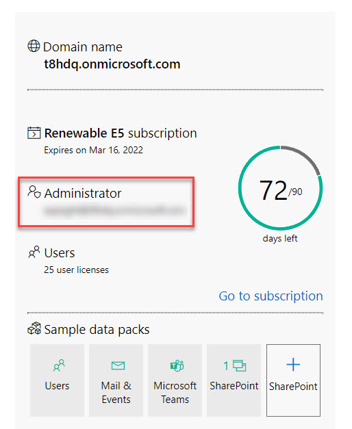
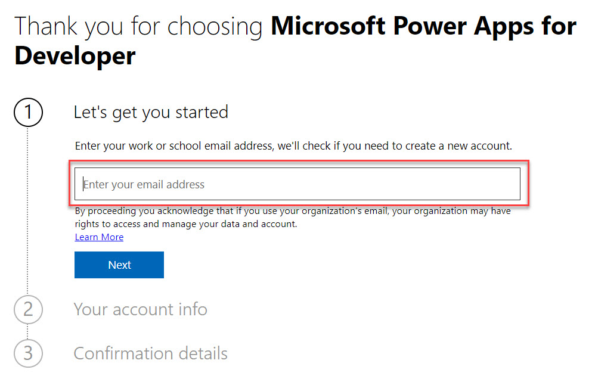
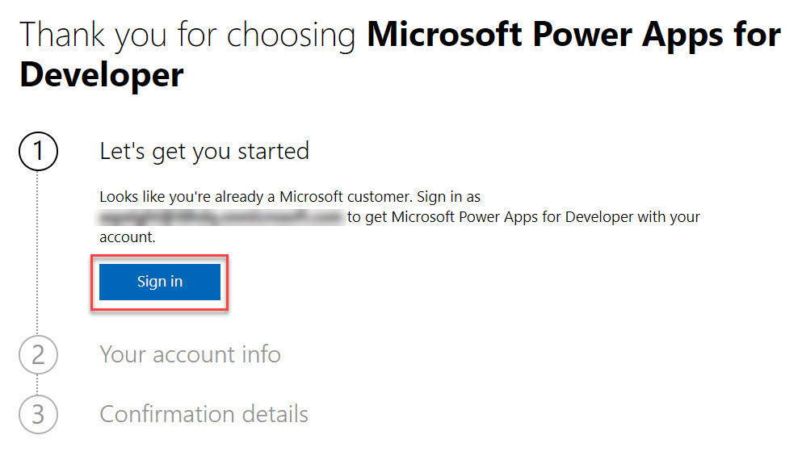
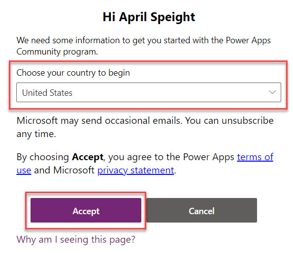
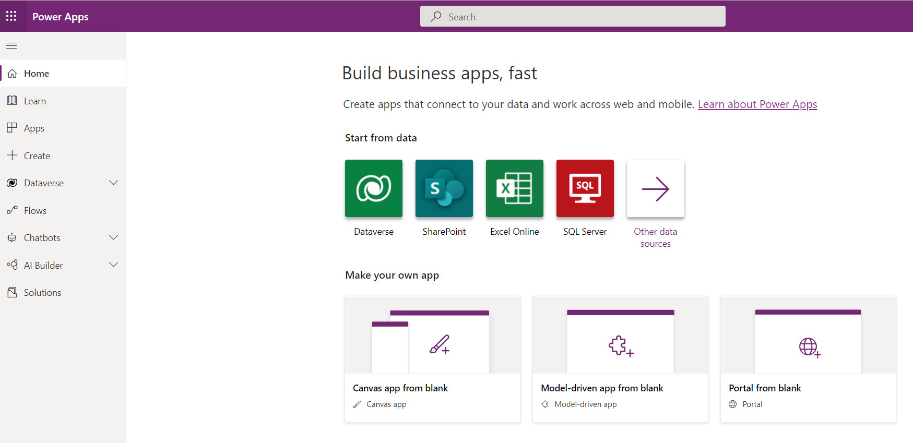

# Lab 00 - Setup your environment

> **NOTE:**
>
> You can do the labs on your own environment, but you have to be careful: when you are using an environment where you are not the admin, it could happen that you don't have enough rights to perform all actions. You could for instance run into a Data Loss Prevention (DLP) policy which could block the usage of the custom connector you are going to build in Lab 01.

## Step 1: Create your own developer tenant

You can create your own developer tenant through the Microsoft 365 Developer Program. Go to the Microsoft 365 Developer Program website and make sure to register for a free 25-user tenant. When you are done creating the tenant, make sure to go to the next step.

1. Go to [developer.microsoft.com/microsoft-365/dev-program](https://developer.microsoft.com/microsoft-365/dev-program).
1. Click **Join now**.

    

1. Sign in to your Microsoft account or Create a Microsoft account

    **Note**: First try signing in with your school account as you may already have access to the platforms that’ll be used for this workshop. Alternatively, you can create a new account using your personal email address. If you’re creating a new account, you’ll need to validate the account with a phone number.

1. Complete the **Join the Microsoft 365 Developer Program!** form.
1. After your account is created, go to [developer.microsoft.com/microsoft-365/profile](https://developer.microsoft.com/microsoft-365/profile) to retrieve your username. If you are not signed in, sign in using your Microsoft account (the same credentials from **Step 3**).
1. Copy/Save the **Administrator** email address for signing into the Power Apps portal.

    

## Step 2: Add a Power Platform Developer account to the account you have in the developer tenant

The Power Apps Developer Plan gives you a free development environment to build and test with Power Apps, Power Automate, and Microsoft Dataverse. In this workshop, the Power Apps Developer Plan enables you to create a custom connector in lab 1.

1. Go to [powerapps.microsoft.com/developerplan](https://powerapps.microsoft.com/developerplan).
1. Click **Get started free**.
1. For **Step 1**, enter your **M365 Dev Program** email address (the **Administrator** email address).
1
    
1. You should receive the following message:

    

    Click **Sign in** and sign-in using your M365 Dev Program credentials (the **Administrator** email address).

    **Note**: If you need to do a password reset, click Forgot my password.
1. After you sign in, click **Get Started**.

    

1. Select your country and click **Accept**.

    

1. Go to [make.powerapps.com](https://make.powerapps.com) to confirm that you can access the Power Apps portal.

    

## Step 3: Download & Sign-In to Power Apps

1. Go to your phone’s app store.
1. Search for **Power Apps**
1. Download the app.
1. Sign-in using your M365 Dev Program credentials (the **Administrator** email address).